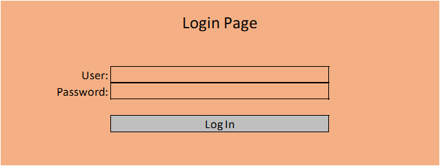
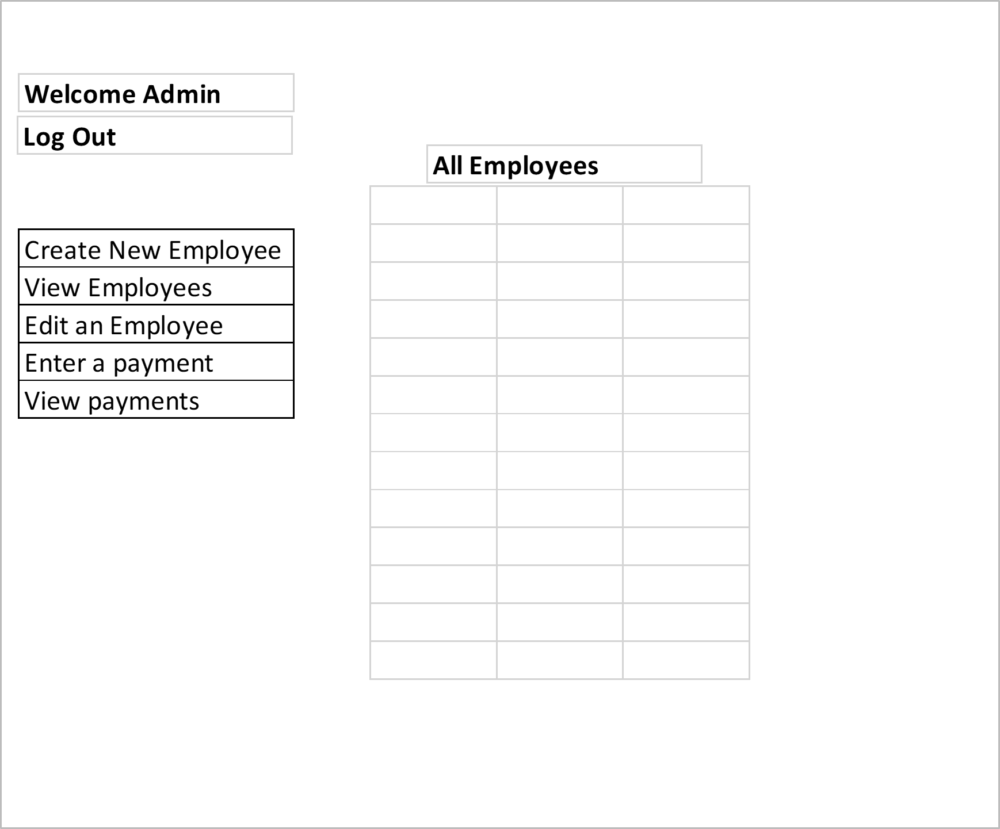

# Project IV Employee Database by Kaushik Guha
#### Front End

## User Story

The Employee DB is a simple employee database that can store employee information and see what payments have been made to an employee.

On the home screen of the app users can see details of the app. It is a non dynamic home screen.
In the Nav bar, the employee should see log in or sign up tabs which allow the user to sign in or sign up respectively.

The app has a log in functionality where users can log in. Once logged in users have the ability to create new payments or edit/delete any existing payments. This database is designed for companies to allow users to enter any payments that may be due to them. This is a good starting point to potentially add functionality.

## The Front End (FE)

For the FE we used REACT and styled it with Bootstrap as well as more traditional CSS elements. We also used application programming interface (API) which we discuss in the following section.

## The API

The API for this particular website is to retrieve data from the backend.

## The Back End (BE)

For the backend we used Python Flask and contains the CRUD routes. Some of the routes we used include

1. GET to show a list of all payments
2. PUT route to update payments
3. DELETE route to destroy payments

There are other GET routes and POST routes for the users as well.

## Database

For the database to store all the data we have used PostgreSQL. is a free and open-source relational database management system (RDBMS) emphasizing extensibility and SQL compliance. It was originally named POSTGRES, referring to its origins as a successor to the Ingres database developed at the University of California, Berkeley. PostgreSQL features transactions with Atomicity, Consistency, Isolation, Durability (ACID) properties, automatically updatable views, materialized views, triggers, foreign keys, and stored procedures.[17] It is designed to handle a range of workloads, from single machines to data warehouses or Web services with many concurrent users. For further details please refer to:

https://www.postgresql.org/

SQLite is an in-process library that implements a self-contained, serverless, zero-configuration, transactional SQL database engine. The code for SQLite is in the public domain and is thus free for use for any purpose, commercial or private. SQLite is the most widely deployed database in the world with more applications than we can count, including several high-profile projects.
For further information please refer to:

https://www.sqlite.org/index.html

##Deployment

The app was deployed using Heroku hobby version.

## Original Wire Frames

 

 

 

 

